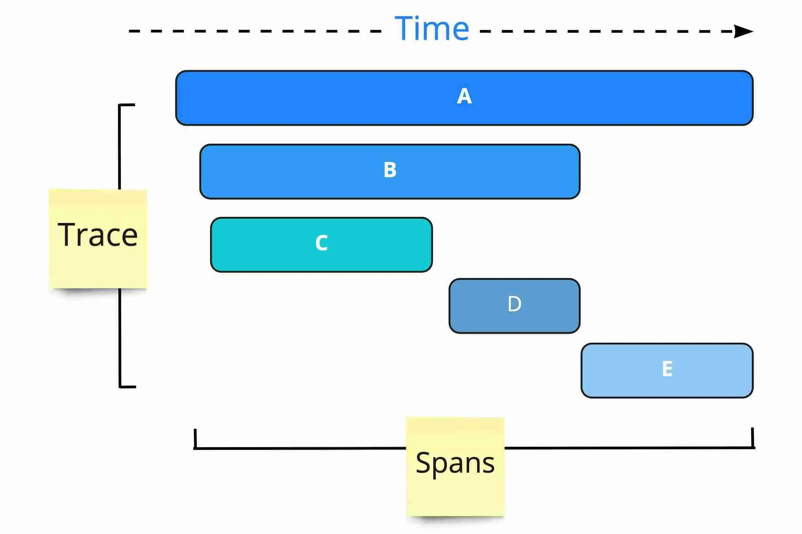

# Adding custom attributes

⭐ An span attribute is going to describe a particular span.

### https://opentelemetry.io/docs/demo/manual-span-attributes/

In Jaeger it´s the ``Tags`` ❗

### Add an import for OpenTelemetry API
```
import { trace, Span } from '@opentelemetry/api';
```

### Get the active span and add custom attributes
```
const span: Span = trace.getActiveSpan();

// a single attribute
span?.setAttribute('key', 'value');

// or multiple attributes at the same time
span?.setAttributes({ key1: value1, key2: value2 });
```

---


