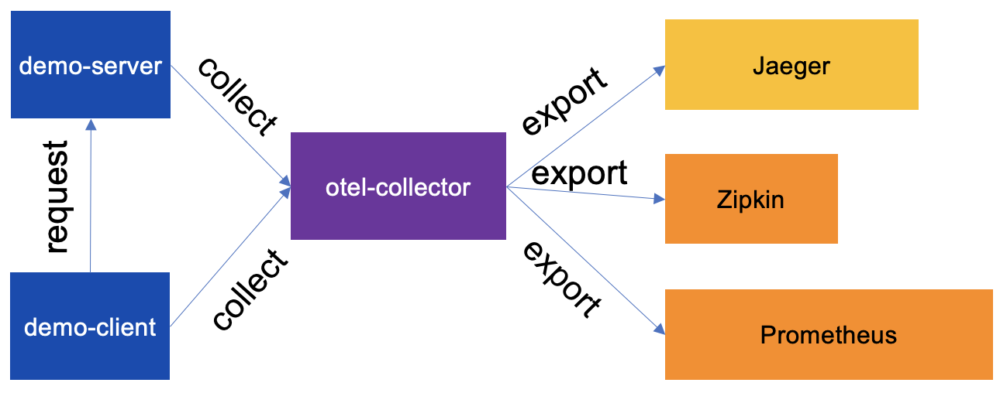

# Running and using the OpenTelemetry collector

https://github.com/open-telemetry/opentelemetry-collector-contrib

https://opentelemetry.io/docs/instrumentation/js/exporters/

---

## 🄰 Receivers and Exporters

https://github.com/open-telemetry/opentelemetry-collector-contrib/tree/main/receiver

https://github.com/open-telemetry/opentelemetry-collector-contrib/tree/main/exporter

### Configure the collector
Add the following content to `collector/config.yml`

```yml
receivers:
  otlp:
    protocols:
      http:
        endpoint: 0.0.0.0:4318
      grpc:
        endpoint: 0.0.0.0:4317
processors:
exporters:
  debug:
  prometheus:
    endpoint: "0.0.0.0:8889"
    send_timestamps: true
    namespace: otel
    const_labels:
      via: collector
  otlp/jaeger:
    endpoint: jaeger:4317
    tls:
      insecure: true
extensions:
  health_check:
service:
  extensions: [health_check]
  pipelines:
    traces:
      receivers: [otlp]
      processors: []
      exporters: [otlp/jaeger]
    metrics:
      receivers: [otlp]
      processors: []
      exporters: [prometheus]
```

### Run the collector
Add the following service to `docker-compose.yml`

```yml
collector:
  image: otel/opentelemetry-collector-contrib
  volumes:
    - ./collector/config.yml:/etc/otel-collector-config.yml
  command: ["--config=/etc/otel-collector-config.yml"]
  ports:
    - "8889:8889"
    - "4317:4317"
    - "4318:4318"
  depends_on:
    - jaeger
    - prometheus
```

### Adjust Prometheus to scrap to collector
Replace the target configuration in `prometheus.yml` to `- targets: ['collector:8889']`

### Adjust The OpenTelemetry collector traces
Change to `OTLPTraceExporter` URL to `http://collector:4318/v1/traces`

### Adjust The OpenTelemetry collector metrics
Instead of using `exporter-prometheus` install

```bash
yarn add exporter-metrics-otlp-proto
```

Then replace `exporter` with the following code

```typescript
import { MeterProvider, PeriodicExportingMetricReader } from '@opentelemetry/sdk-metrics';
import { OTLPMetricExporter } from '@opentelemetry/exporter-metrics-otlp-proto';

const metricReader: PeriodicExportingMetricReader = new PeriodicExportingMetricReader({
    exporter: new OTLPMetricExporter({
        url: 'http://collector:4318/v1/metrics'
    })
});

meterProvider.addMetricReader(metricReader);

const meter: Meter = meterProvider.getMeter(`${serviceName}-service-meter`);
```

--- 

## 🄱 Processors

https://github.com/open-telemetry/opentelemetry-collector/blob/main/processor

https://github.com/open-telemetry/opentelemetry-collector-contrib/tree/main/processor

### Configure the collector
Add the following content to `collector/config.yml`

```yml
# [...]
```

```yml
processors:
  batch:
service:
  extensions: [health_check]
  pipelines:
    traces:
      receivers: [otlp]
      processors: [batch]
      exporters: [debug, otlp/jaeger, zipkin]
    metrics:
      receivers: [otlp]
      processors: [batch]
      exporters: [debug, prometheus]
```

```yml
# [...]
```

---


