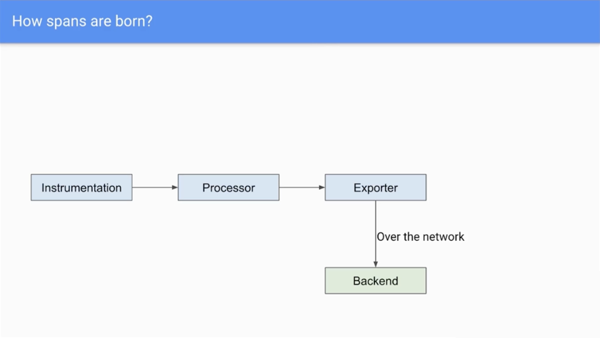

# Span processor performance tuning

A span processor sends to data to the exporter.
The processor in OpenTelemetry is responsible for transforming and processing this data. This can include filtering data, adding tags, or enriching data with additional information. By using processors, developers can customize and format the telemetry data to better suit their specific needs.

By default, the Node SDK uses the `BatchSpanProcessor`, and this span processor is also chosen in the Web SDK example. The BatchSpanProcessor processes spans in batches before they are exported. This is usually the right processor to use for an application.

https://opentelemetry.io/docs/instrumentation/js/manual/

https://github.com/open-telemetry/opentelemetry-js/tree/main/packages/opentelemetry-sdk-trace-base/src/export

### Option #1 - via code
Add the following partially to `tracer.ts` file

```typescript
spanProcessor: new BatchSpanProcessor(
    new OTLPTraceExporter({
        url: 'http://jaeger:4318/v1/traces',
    }), 
    {
        // The maximum batch size of every export. It must be smaller or equal to maxQueueSize. The default value is 512.
        maxExportBatchSize: 1024,
    
        // The delay interval in milliseconds between two consecutive exports. The default value is 5000ms.
        scheduledDelayMillis: 1000,
    
        // How long the export can run before it is cancelled. The default value is 30000ms
        exportTimeoutMillis: 10000,
    
        // The maximum queue size. After the size is reached spans are dropped. The default value is 2048.
        maxQueueSize: 1024
    }
)
```

like this

```typescript
// [...]
import { BatchSpanProcessor } from '@opentelemetry/sdk-trace-node'
import { BufferConfig } from '@opentelemetry/sdk-trace-base/build/src/types';

const exporter: OTLPTraceExporter = new OTLPTraceExporter({
    url: 'http://jaeger:4318/v1/traces',
});

const bufferConfig: BufferConfig = {
    maxExportBatchSize: 1024,
    scheduledDelayMillis: 1000,
    exportTimeoutMillis: 10000,
    maxQueueSize: 1024
};

const sdk: NodeSDK = new NodeSDK({
    traceExporter: exporter,
    // [...]
    spanProcessor: new BatchSpanProcessor(exporter, bufferConfig)
});
```

### Option #1 - via env variable 

❗ `BatchSpanProcessor` is the default Processor

Add the following partially to `docker-compose.yml` file

```yml

```

---


