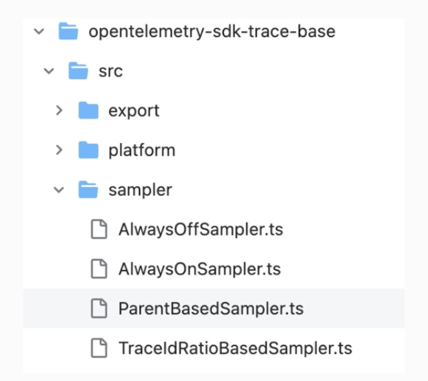
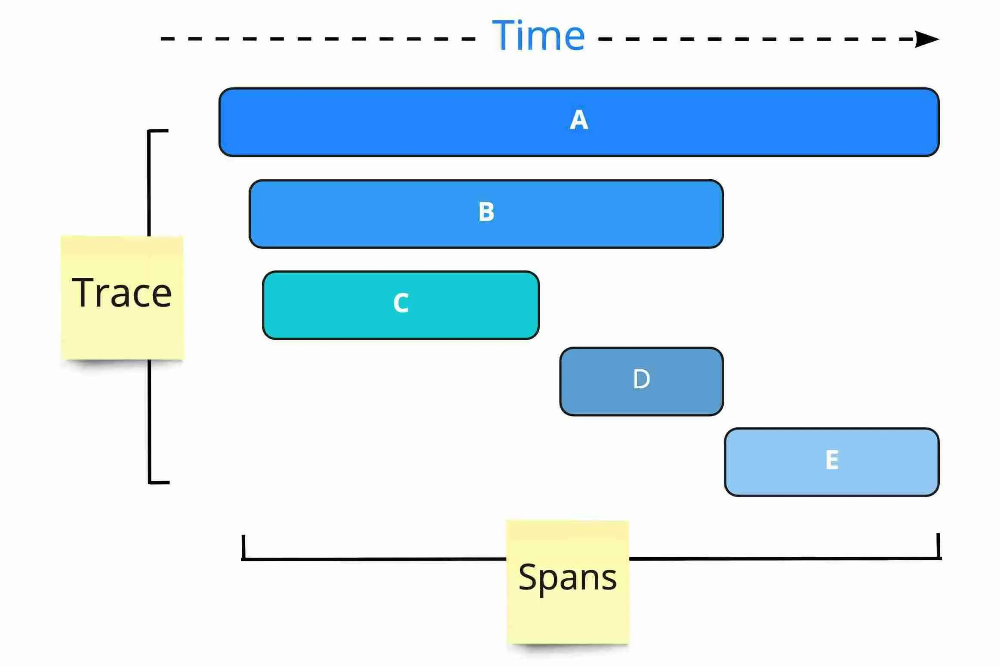

# Sampling traces

##### https://opentelemetry.io/docs/concepts/sampling/

In OpenTelemetry, sampling refers to the process of determining which spans should be recorded and sent to the backend for further analysis. Sampling is a crucial aspect of distributed tracing systems because it helps manage the volume of telemetry data generated by applications.

#### Head- und Tail-Sampling
- Head Sampling:
  * Definition: Captures a representative sample of the initial requests or transactions in a distributed system.
  * Purpose: The goal is to capture the early part of a trace to identify trends and behavioral patterns at the beginning.
  * In Application with Otel SDK
  

- Tail Sampling:
  * Definition: Captures a representative sample of the final requests or transactions in a distributed system.
  * Purpose: The goal is to capture the end of a trace, focusing on requests or transactions with longer durations or unusual behavior.
  * In Otel Collector

### Create custom-sampler.ts file
```typescript
import { Attributes, Context, Link, SpanKind } from '@opentelemetry/api';
import { PrometheusExporter } from '@opentelemetry/exporter-prometheus';
import { Sampler, SamplingResult, SamplingDecision } from '@opentelemetry/sdk-trace-base';
import { SemanticAttributes } from '@opentelemetry/semantic-conventions';

export class CustomSampler implements Sampler {
  public shouldSample(context: Context, traceId: string, spanName: string, spanKind: SpanKind, attributes: Attributes, links: Link[]): SamplingResult {
    const { endpoint }: { endpoint: string } = PrometheusExporter.DEFAULT_OPTIONS;
    const attribute: AttributeValue = attributes[SemanticAttributes.HTTP_TARGET];
    let decision: SamplingDecision;

    if (attribute === endpoint) {
      decision = SamplingDecision.NOT_RECORD;
    } else {
      decision = SamplingDecision.RECORD_AND_SAMPLED;
    }

    return {
      decision
    }
  }
}
```

Add the following code to the NodeSDK object

```typescript
// [...]

import { CustomSampler } from './custom-sampler';

sampler: new ParentBasedSampler({
    root: new CustomSampler()
})
```

like this

```typescript
// [...]

const sdk: NodeSDK = new NodeSDK({
  traceExporter,
  serviceName,
  instrumentations,
  sampler: new ParentBasedSampler({
    root: new CustomSampler()
  })    
});
```

---



### AlwaysOffSampler
- https://open-telemetry.github.io/opentelemetry-js/classes/_opentelemetry_sdk_trace_base.AlwaysOffSampler.html
- The AlwaysOffSampler is a sampler that never samples any spans. It is useful when to completely disable sampling, and none of the spans are sent to the backend.

### AlwaysOnSampler
- https://open-telemetry.github.io/opentelemetry-js/classes/_opentelemetry_core.AlwaysOnSampler.html
- The AlwaysOnSampler in OpenTelemetry is a sampler that always samples every span. It ensures that every trace in an application is recorded and sent to the backend for further analysis. This is useful when to capture the complete trace information without any sampling.

### ParentBasedSampler
- https://open-telemetry.github.io/opentelemetry-js/classes/_opentelemetry_sdk_trace_base.ParentBasedSampler.html
- A composite sampler that either respects the parent span's sampling decision or delegates to ```delegateSampler``` for root spans.

### TraceIdRatioBasedSampler
- https://open-telemetry.github.io/opentelemetry-js/classes/_opentelemetry_core.TraceIdRatioBasedSampler.html
- Sampler that samples a given fraction of traces based of trace id deterministically.

---


